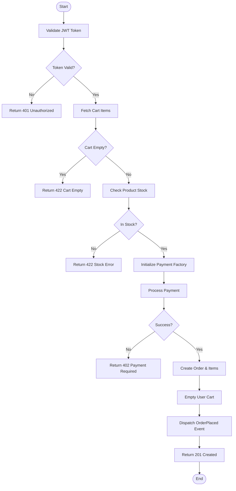

# Activity Diagram: Checkout Process

This diagram maps the logical decision-making flow for converting a cart into a finalized order.

> **Note:** Mermaid uses `flowchart` logic for activities if the renderer doesn't support the experimental `activityDiagram` keyword.
