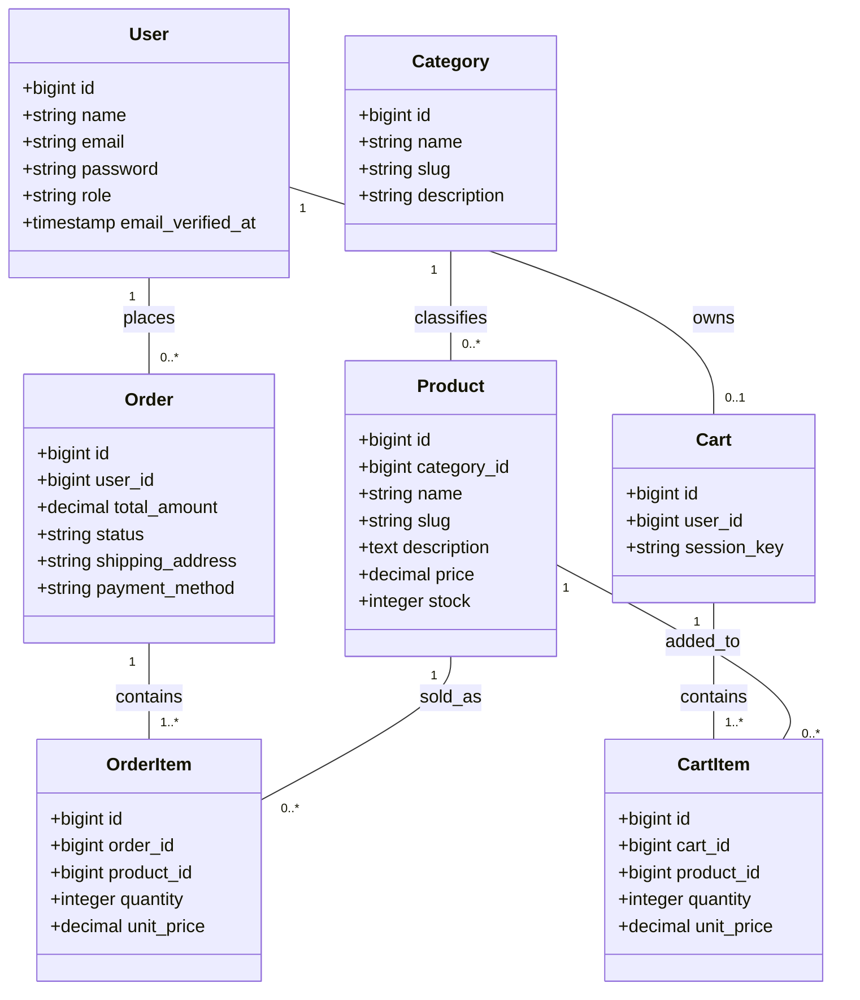

# Class Diagram (Entity Relationships)

This diagram represents the static structure and data associations of the E-Commerce API System, aligned with the PDF requirements.

```mermaid
classDiagram
    class User {
        +bigint id
        +string name
        +string email
        +string password
        +string role
        +timestamp email_verified_at
    }

    class Category {
        +bigint id
        +string name
        +string slug
        +string description
    }

    class Product {
        +bigint id
        +bigint category_id
        +string name
        +string slug
        +text description
        +decimal price
        +integer stock
    }

    class Cart {
        +bigint id
        +bigint user_id
        +string session_key
    }

    class CartItem {
        +bigint id
        +bigint cart_id
        +bigint product_id
        +integer quantity
        +decimal unit_price
    }

    class Order {
        +bigint id
        +bigint user_id
        +decimal total_amount
        +string status
        +string shipping_address
        +string payment_method
    }

    class OrderItem {
        +bigint id
        +bigint order_id
        +bigint product_id
        +integer quantity
        +decimal unit_price
    }

    User "1" -- "0..*" Order : places
    User "1" -- "0..1" Cart : owns
    Category "1" -- "0..*" Product : classifies
    Cart "1" -- "1..*" CartItem : contains
    Product "1" -- "0..*" CartItem : added_to
    Order "1" -- "1..*" OrderItem : contains
    Product "1" -- "0..*" OrderItem : sold_as
```
