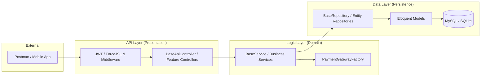

# Component Diagram (System Architecture)

This diagram visualizes the high-level decoupling of the E-Commerce API into distinct layers: Controllers, Services, and Repositories.

```mermaid
graph LR
    subgraph "External"
        Client[Postman / Mobile App]
    end

    subgraph "API Layer (Presentation)"
        Middleware[JWT / ForceJSON Middleware]
        Controller[BaseApiController / Feature Controllers]
    end

    subgraph "Logic Layer (Domain)"
        Service[BaseService / Business Services]
        Factory[PaymentGatewayFactory]
    end

    subgraph "Data Layer (Persistence)"
        Repo[BaseRepository / Entity Repositories]
        Model[Eloquent Models]
        DB[(MySQL / SQLite)]
    end

    Client --> Middleware
    Middleware --> Controller
    Controller --> Service
    Service --> Repo
    Service --> Factory
    Repo --> Model
    Model --> DB
```
