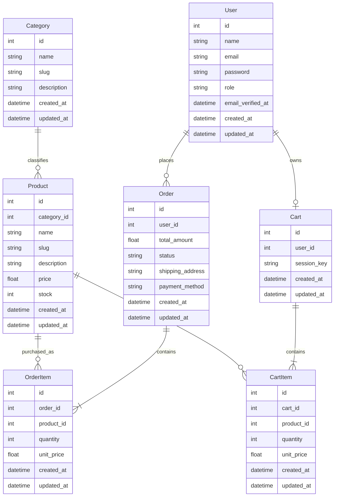

# Enhanced Entity-Relationship (EER) Diagram

This diagram provides a high-fidelity view of the data layer based on the official Software Engineering Project Requirements.

```mermaid
erDiagram
    User {
        int id
        string name
        string email
        string password
        string role
        datetime email_verified_at
        datetime created_at
        datetime updated_at
    }

    Category {
        int id
        string name
        string slug
        string description
        datetime created_at
        datetime updated_at
    }

    Product {
        int id
        int category_id
        string name
        string slug
        string description
        float price
        int stock
        datetime created_at
        datetime updated_at
    }

    Cart {
        int id
        int user_id
        string session_key
        datetime created_at
        datetime updated_at
    }

    CartItem {
        int id
        int cart_id
        int product_id
        int quantity
        float unit_price
        datetime created_at
        datetime updated_at
    }

    Order {
        int id
        int user_id
        float total_amount
        string status
        string shipping_address
        string payment_method
        datetime created_at
        datetime updated_at
    }

    OrderItem {
        int id
        int order_id
        int product_id
        int quantity
        float unit_price
        datetime created_at
        datetime updated_at
    }

    User ||--o{ Order : places
    User ||--o| Cart : owns
    Category ||--o{ Product : classifies
    Product ||--o{ CartItem : included_in
    Product ||--o{ OrderItem : purchased_as
    Cart ||--|{ CartItem : contains
    Order ||--|{ OrderItem : contains
```
