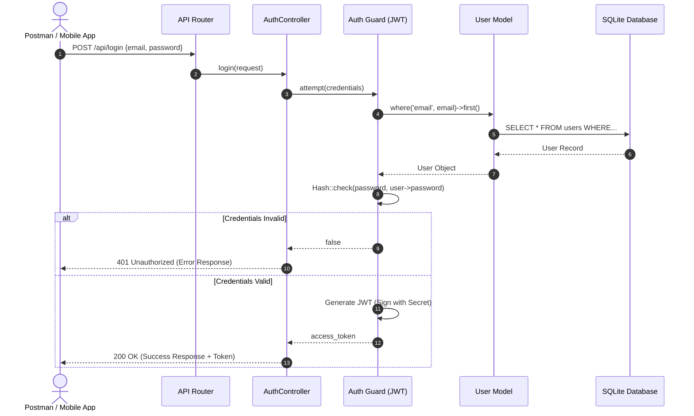

# Sequence Diagram: Stateless JWT Authentication

This diagram details the chronological interaction for verifying credentials and generating a stateless token.

```mermaid
sequenceDiagram
    autonumber
    actor Client as Postman / Mobile App
    participant Router as API Router
    participant AuthCtrl as AuthController
    participant Guard as Auth Guard (JWT)
    participant UserModel as User Model
    participant DB as SQLite Database

    Client->>Router: POST /api/login {email, password}
    Router->>AuthCtrl: login(request)
    AuthCtrl->>Guard: attempt(credentials)
    Guard->>UserModel: where('email', email)->first()
    UserModel->>DB: SELECT * FROM users WHERE...
    DB-->>UserModel: User Record
    UserModel-->>Guard: User Object
    Guard->>Guard: Hash::check(password, user->password)

    alt Credentials Invalid
        Guard-->>AuthCtrl: false
        AuthCtrl-->>Client: 401 Unauthorized (Error Response)
    else Credentials Valid
        Guard->>Guard: Generate JWT (Sign with Secret)
        Guard-->>AuthCtrl: access_token
        AuthCtrl-->>Client: 200 OK (Success Response + Token)
    end
```
