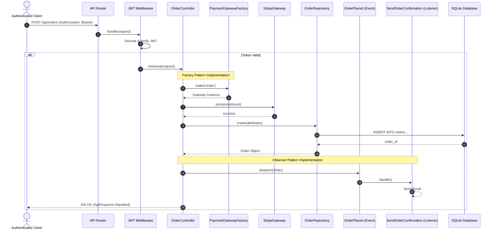

# Sequence Diagram: Protected Checkout Flow

This diagram illustrates how the system handles a complex, authenticated request using the Repository, Factory, and Observer patterns.

```mermaid
sequenceDiagram
    autonumber
    actor Client as Authenticated Client
    participant Router as API Router
    participant Middleware as JWT Middleware
    participant OrderCtrl as OrderController
    participant Factory as PaymentGatewayFactory
    participant Gateway as StripeGateway
    participant OrderRepo as OrderRepository
    participant Event as OrderPlaced (Event)
    participant Observer as SendOrderConfirmation (Listener)
    participant DB as SQLite Database

    Client->>Router: POST /api/orders (Authorization: Bearer)
    Router->>Middleware: handle(request)
    Middleware->>Middleware: Decode & Verify JWT

    alt Token Valid
        Middleware->>OrderCtrl: checkout(request)

        Note over OrderCtrl, Factory: Factory Pattern Implementation
        OrderCtrl->>Factory: make('stripe')
        Factory-->>OrderCtrl: Gateway Instance
        OrderCtrl->>Gateway: process(amount)
        Gateway-->>OrderCtrl: success

        OrderCtrl->>OrderRepo: create(attributes)
        OrderRepo->>DB: INSERT INTO orders...
        DB-->>OrderRepo: order_id
        OrderRepo-->>OrderCtrl: Order Object

        Note over OrderCtrl, Observer: Observer Pattern Implementation
        OrderCtrl->>Event: dispatch(Order)
        Event->>Observer: handle()
        Observer-->>Observer: Send Email

        OrderCtrl-->>Client: 200 OK (ApiResponse Standard)
    end
```
