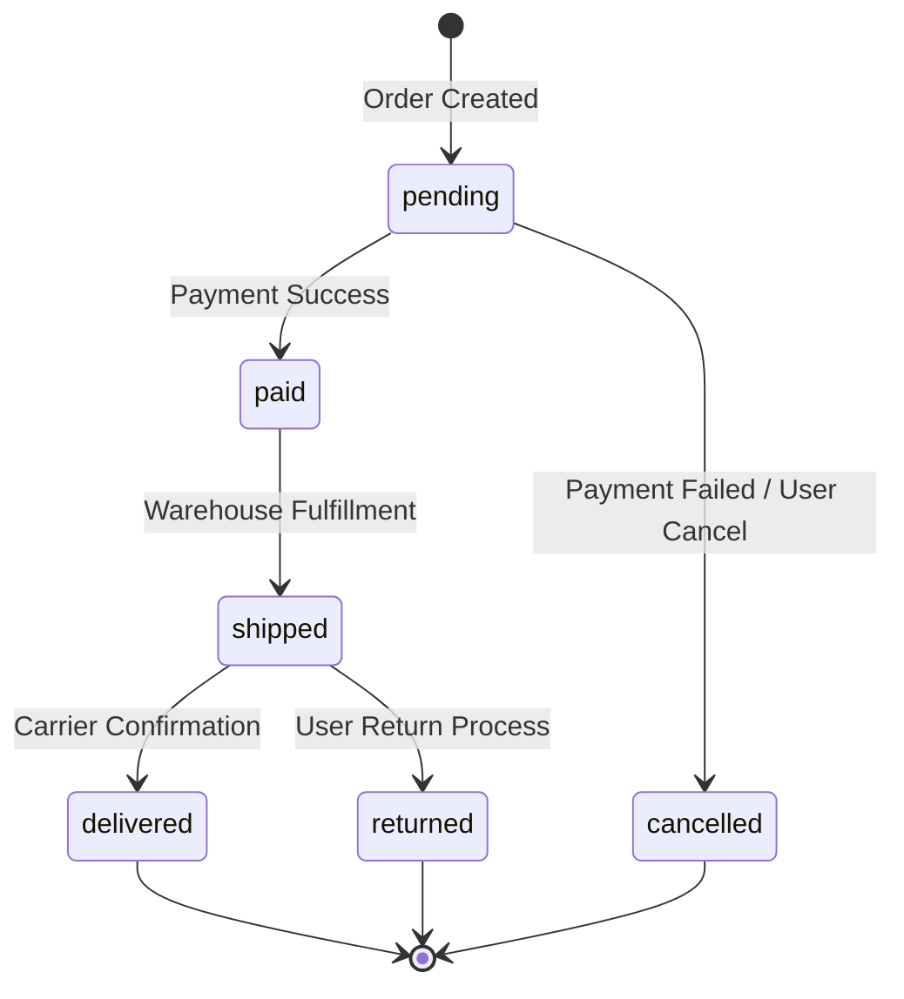

# State Machine Diagram: Order Status

This diagram defines the allowed transitions for an Ecommerce Order's status.

```mermaid
stateDiagram-v2
    [*] --> pending: Order Created
    pending --> paid: Payment Success
    pending --> cancelled: Payment Failed / User Cancel
    paid --> shipped: Warehouse Fulfillment
    shipped --> delivered: Carrier Confirmation
    shipped --> returned: User Return Process
    delivered --> [*]
    cancelled --> [*]
    returned --> [*]
```
