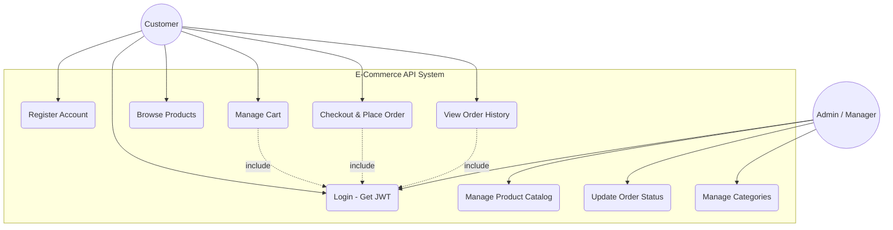

# Use Case Diagram

This diagram models the interactions between external actors and the E-Commerce API System.

```mermaid
graph TD
    subgraph "E-Commerce API System"
        UC1(Register Account)
        UC2(Login - Get JWT)
        UC3(Browse Products)
        UC4(Manage Cart)
        UC5(Checkout & Place Order)
        UC6(View Order History)
        UC7(Manage Product Catalog)
        UC8(Update Order Status)
        UC9(Manage Categories)
    end

    Customer((Customer))
    Admin((Admin / Manager))

    Customer --> UC1
    Customer --> UC2
    Customer --> UC3
    Customer --> UC4
    Customer --> UC5
    Customer --> UC6

    Admin --> UC2
    Admin --> UC7
    Admin --> UC8
    Admin --> UC9

    UC4 -.->|include| UC2
    UC5 -.->|include| UC2
    UC6 -.->|include| UC2
```
